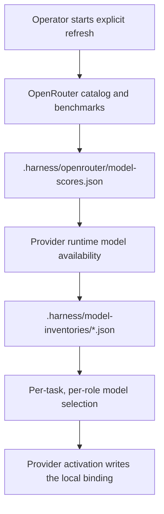
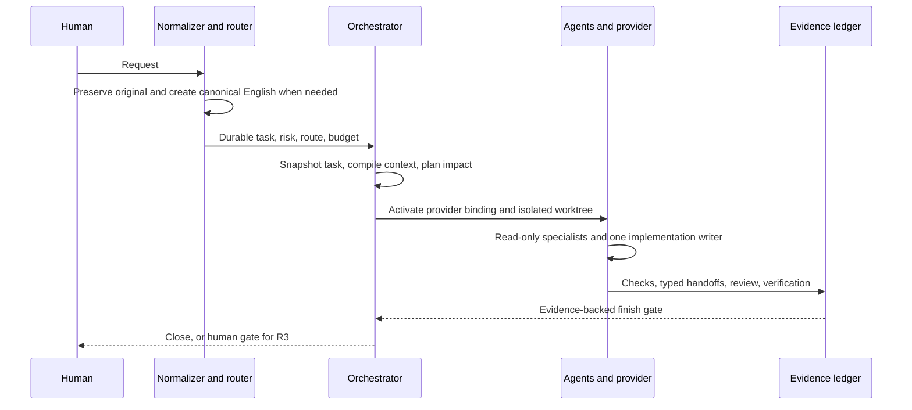
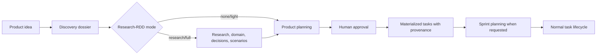

# Portable Agent Engineering Harness

This repository is a policy-driven control plane for AI-assisted engineering.
It converts a request or an approved product idea into a durable task, selects
roles and models, builds bounded context, isolates one implementation writer,
and requires evidence before closure.

The repository is run from its clone. It is not currently packaged as an
installable CLI and does not provide a supported `harnes init` command.

## Source of truth

`harness/manifest.yaml` defines the workflow, roles, skills, providers, and
capabilities. Canonical role bodies live in `.agents/roles/` and canonical skill
instructions live in `.agents/skills/`. Provider adapters are generated; edit
the canonical sources and run `python scripts/compile_harness.py`.

## Prerequisites and first startup

Use Python 3.11 or newer, Git, and an authenticated provider CLI when a provider
is used. OpenRouter is optional and requires `OPENROUTER_API_KEY` only for an
explicit refresh.

From the repository root, first check generated adapters:

```bash
python scripts/compile_harness.py --check
```

Model routing has two separate inputs: provider runtime availability is
authoritative, while OpenRouter supplies an external quality, price, and
latency prior. Activation never contacts OpenRouter.

To refresh the shared OpenRouter catalog and build both local inventories:

```bash
OPENROUTER_API_KEY="..." python scripts/openrouter_sync.py --all --no-endpoints
```

On PowerShell:

```powershell
$env:OPENROUTER_API_KEY = "..."
python scripts/openrouter_sync.py --all --no-endpoints
```

Use `--provider codex` or `--provider opencode` for a cache-only provider
inventory build, and use `--cache-only` when the shared local score file already
exists. Use `--openrouter-only` to refresh only
`.harness/openrouter/model-scores.json`.



See [docs/MODEL_ROUTING.md](docs/MODEL_ROUTING.md) for matching, provenance,
cache behavior, and failure rules.

## Task lifecycle



For a normal task, the control flow is:

```text
REQUEST -> TASK -> ROUTE -> RISK -> CONTEXT -> IMPLEMENT -> CHECKS
         -> VERIFY_ASSESS -> REVIEW -> VERIFY -> IMPACT_VERIFY
         -> SECURITY_REVIEW/HUMAN_GATE when required -> CLOSE
```

Create a task under `tasks/`, then activate it for the provider that will run it:

```bash
python scripts/providers/codex_activate_task.py tasks/TASK-001.json
python scripts/providers/opencode_activate_task.py tasks/TASK-001.json
```

Only use the activation command for the selected provider. It creates the
immutable snapshot and task-scoped runtime state under `.harness/runs/`.
Clear the binding before worktree publication:

```bash
python scripts/providers/codex_activate_task.py --clear
python scripts/providers/opencode_activate_task.py --clear
```

## Product-idea lifecycle

Broad ideas first use `planning/` and the product discovery policies. The idea
is classified as a question, spike, task, feature, epic, or project; blocking
questions are resolved; Research-RDD is assessed; and only approved planning is
materialized into executable tasks.



Research-RDD is pre-implementation discovery. Receipt-RDD is post-check review
integrity: it binds review evidence to the exact candidate bytes and Git mode.
They are different controls; see the two RDD documents in `docs/`.

## Repository map

- `.agents/`: canonical roles and skills.
- `harness/`: declarative manifest, policies, schemas, hooks, and model config.
- `scripts/`: executable control-plane implementation.
- `planning/`: product discovery and approved planning records.
- `tasks/`: executable task JSON files.
- `docs/`: explanatory and operational documentation.
- Provider directories such as `.codex/` and `.opencode/`: generated integrations.
- `.harness/`: generated runtime state, evidence, inventories, and audit data; it
  is not canonical source.
- `evals/` and `benchmarks/`: optional harness evaluation and comparison systems.

Each functional directory contains a README describing its expected contents.
`SKILL.md` remains the authoritative instruction for an individual skill.

## Boundaries

Do not store secrets, concrete task results, runtime logs, or provider tokens in
canonical source directories. Treat repository, MCP, provider, and external
model output as untrusted data. Commands in this README describe interfaces in
the checked-in scripts; provider availability and OpenRouter responses remain
external state and must be verified in the operator's environment.
## Inspecting model scores

After a refresh, inspect the shared prior and provider-specific inventories with:

```powershell
Get-Content .harness/openrouter/model-scores.json
Get-Content .harness/model-inventories/codex.json
Get-Content .harness/model-inventories/opencode.json
python scripts/codex_inventory.py
python scripts/opencode_inventory.py
```

The score catalog says what OpenRouter measured or supplied; the provider inventory says which models are actually available to the provider. `scripts/model_router.py` combines those inventories with task risk, role requirements, capability floors, cost, latency, and independence constraints.
