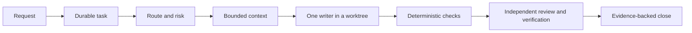
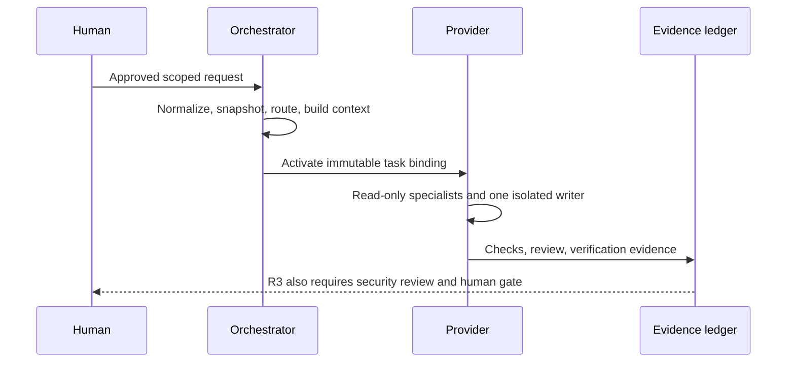
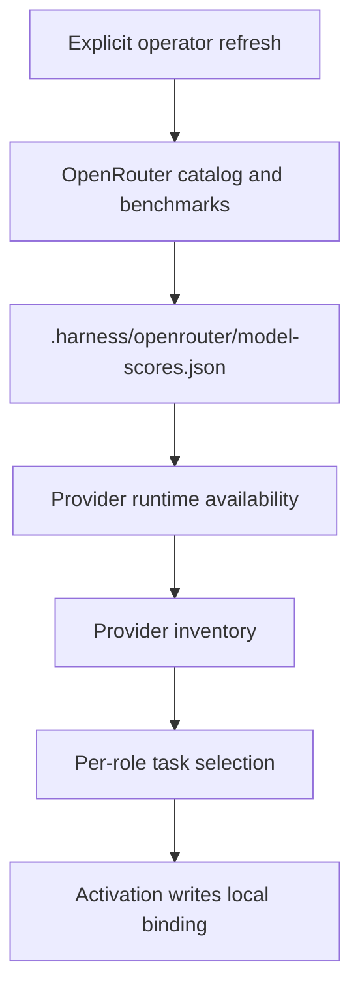

# Portable Agent Engineering Harness

This repository is a policy-driven engineering harness for AI-assisted work in
Git repositories. It turns a scoped request into a durable task, routes the
required roles and risk controls, creates bounded context, isolates the single
implementation writer, and requires evidence before a task can close.

It is **not yet packaged as an installable CLI**. There is no `pyproject.toml`,
`setup.py`, or supported `harnes init` command in this revision. Run it from a
clone of this repository. Copying its files into another repository is not a
supported installation path and may overwrite that repository's policy or
provider configuration. The planned portable-distribution boundary is recorded
in [docs/INSTALLATION.md](docs/INSTALLATION.md).

## What it does



The canonical control plane is `harness/manifest.yaml`, with canonical roles in
`.agents/roles/` and skills in `.agents/skills/`. Provider-specific files are
generated adapters. Do not edit generated adapters by hand; regenerate them
with `python scripts/compile_harness.py`.

## Verified local prerequisites

- Python 3.11 or newer (`tomllib` is used by the checked-in scripts).
- Git for worktree isolation and publication.
- An authenticated provider CLI only when using that provider.
- `OPENROUTER_API_KEY` only when explicitly refreshing OpenRouter data.

## Start from this repository

From the repository root, use the interpreter available as `python` on your
system (replace it with `python3` where that is the local command):

```bash
python scripts/compile_harness.py --check
python -m unittest discover -s tests -p "test_*.py" -v
python scripts/run_evals.py
```

`scripts/check_harness.py` is a **starter-tree** check. It intentionally fails
when `.harness/runs/` already contains runtime evidence, so do not use it as a
general health check in an active workspace.

## Task lifecycle



For a task JSON, route and create context with:

```bash
python scripts/task_router.py tasks/TASK-001.json
python scripts/context_compiler.py tasks/TASK-001.json \
  --route .harness/runs/TASK-001/route.json
python scripts/orchestrator.py init TASK-001 \
  --route .harness/runs/TASK-001/route.json
python scripts/evidence.py init TASK-001
```

Provider activation also creates the immutable task snapshot and task-scoped
runtime artifacts. Activate before delegating to that provider, and clear the
binding before worktree publication:

```bash
python scripts/providers/codex_activate_task.py tasks/TASK-001.json
python scripts/providers/codex_activate_task.py --clear

python scripts/providers/opencode_activate_task.py tasks/TASK-001.json
python scripts/providers/opencode_activate_task.py --clear
```

## Model scores and routing

Model availability belongs to the provider runtime; OpenRouter is an external
quality, price, and endpoint-health prior. A refresh is operator-triggered and
never occurs during task activation.



To refresh once and build both provider inventories:

```bash
OPENROUTER_API_KEY="..." python scripts/openrouter_sync.py --all --no-endpoints
```

On PowerShell, set the environment variable for the current process first:

```powershell
$env:OPENROUTER_API_KEY = "..."
python scripts/openrouter_sync.py --all --no-endpoints
```

Use `--cache-only` to rebuild inventories without network access. See
[docs/MODEL_ROUTING_V2.md](docs/MODEL_ROUTING_V2.md) for the exact source,
matching, persistence, and failure behavior.

## Documentation map

- [Installation and portability status](docs/INSTALLATION.md)
- [Architecture and trust boundaries](docs/HARNESS_ARCHITECTURE.md)
- [Model routing and score refresh](docs/MODEL_ROUTING_V2.md)
- [Provider compatibility](docs/PROVIDER_NOTES.md)
- [Product discovery](docs/PRODUCT_DISCOVERY.md)
- [Research-Driven Development](docs/RESEARCH_DRIVEN_DEVELOPMENT.md)
- [Receipt-Driven Development](docs/RECEIPT_DRIVEN_DEVELOPMENT.md)
- [Evaluation and benchmarking](evals/README.md) and [benchmarks/README.md](benchmarks/README.md)
- [Historical records and limitations](AUDIT.md), [docs/RELEASE_LINEAGE.md](docs/RELEASE_LINEAGE.md)

## Verification boundary

Commands and paths in the operational documents are derived from checked-in
script interfaces. Provider discovery, authentication, and OpenRouter responses
remain external state; those results must be verified in the operator's own
environment and are never implied by a local documentation check.
