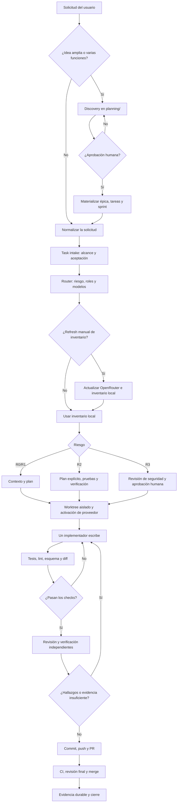
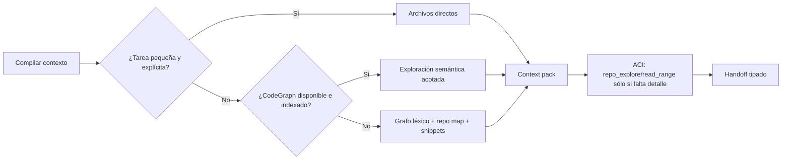
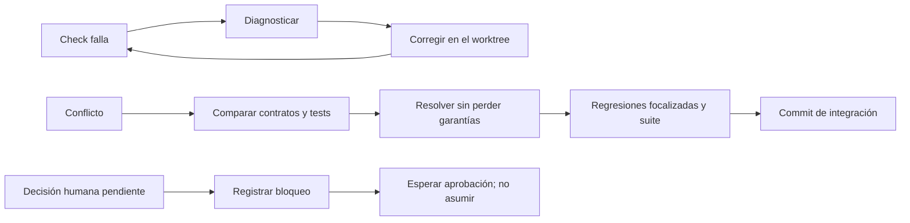

# Flujo operativo del Harness

Esta guía lleva una solicitud desde una idea hasta su integración en `main`. Los contratos ejecutables siguen siendo [AGENTS.md](../AGENTS.md), `harness/manifest.yaml`, `.agents/roles/` y `.agents/skills/`.

## Vista completa



## Métodos que se aplican dentro del flujo

### Carriles de método: RDD, SDD, TDD y CodeGraph

Estos carriles no reemplazan el flujo principal: se activan según la incertidumbre, el riesgo y el contrato de la tarea.

```mermaid
flowchart LR
    U[Pedido] --> R{¿Incertidumbre o decisión costosa?}
    R -- Sí --> RDD[RD: investigar fuentes autorizadas]
    RDD --> DISC[DD: descubrir supuestos, actores y tensiones]
    DISC --> DM[Modelar dominio, decisiones y escenarios]
    DM --> SDD
    R -- No --> SDD[SDD: especificar alcance, aceptación y escenarios]
    SDD --> ROUTE[Routing: riesgo, TDD mode y roles]
    ROUTE --> CG[CodeGraph / contexto estructurado]
    CG --> TDD{Modo TDD}
    TDD -- tdd_required --> RED[RED: prueba falla por la razón esperada]
    RED --> GREEN[GREEN: cambio mínimo]
    GREEN --> REFACTOR[REFACTOR: preservar conducta]
    TDD -- characterization_then_tdd --> CHAR[Caracterizar conducta existente]
    CHAR --> RED
    TDD -- spike_then_tdd --> SPIKE[Spike y contrato técnico]
    SPIKE --> RED
    TDD -- test_after_allowed --> CHECK[Implementar y validar normalmente]
    REFACTOR --> CHECK
    CHECK --> REVIEW[Review, verify y cierre]
```



### RDD — Research-Driven Discovery

Usar RDD sólo cuando la política de investigación indique `research` o `full`: por ejemplo, una API mutable, una migración, un producto nuevo o una decisión difícil de revertir.

1. **Research:** reunir fuentes primarias y registrar fuente, afirmación, incertidumbre y la decisión que cambia.
2. **Discovery:** identificar resultado deseado, interesados, supuestos, tensiones y preguntas bloqueantes.
3. **Domain modeling:** en modo `full`, establecer vocabulario, relaciones e invariantes.
4. **Decision:** comparar alternativas, evidencia, consecuencias y reversibilidad.
5. **Architecture:** describir límites y trazar necesidad → evidencia → decisión → diseño.
6. **Scenarios:** escribir escenarios observables que luego alimentan SDD, BDD o TDD.

RDD produce artefactos en `planning/`; no autoriza por sí solo implementar. Se puede comprobar el estado con:

```powershell
uv run python scripts/research_discovery.py status planning/discovery/DISCOVERY-ID.json
```

### SDD — Spec-Driven Development

En este harness, SDD es la especificación ejecutable de una unidad de trabajo, aunque no exista un script con ese nombre. Antes de escribir producción, la tarea debe dejar claro:

- objetivo y alcance excluido;
- criterios de aceptación observables;
- archivos/superficie probable y dependencias;
- riesgo, contratos externos, datos y rollback;
- escenarios feliz, negativo, límite y de fallo parcial;
- decisiones que requieren aprobación humana.

La tarea, los escenarios y el plan son la fuente de verdad de TDD: el implementador no debe redefinir el contrato para acomodar su propio parche.

### TDD adaptativo

El router decide el modo; no siempre corresponde escribir la prueba primero.

| Modo | Secuencia obligatoria |
| --- | --- |
| `tdd_required` | RED → GREEN → REFACTOR, con evidencia de que RED falló por la razón conductual esperada. |
| `characterization_then_tdd` | Primero capturar el comportamiento legado con pruebas que pasan; después RED → GREEN → REFACTOR. |
| `spike_then_tdd` | Resolver y registrar primero el contrato técnico o externo desconocido; recién entonces TDD. |
| `tdd_preferred` | Test-first si el contrato observable es estable; documentar una excepción. |
| `test_after_allowed` / `not_applicable` | Validación normal, sin simular evidencia RED. |

Siempre considerar ruta feliz, negativa, límites, entrada inválida, fallos parciales, repetición/retry y concurrencia cuando apliquen. La meta es detectar defectos, no inflar cobertura.

### CodeGraph y el contexto

CodeGraph no es el flujo de implementación: es una capa opcional de recuperación de contexto.

1. El compilador decide de forma determinista si una tarea necesita contexto estructurado.
2. Las tareas explícitas y pequeñas usan archivos directos.
3. Las tareas amplias, inciertas o R2/R3 pueden usar CodeGraph si el binario y el índice existen.
4. Si no existe CodeGraph, el harness usa su grafo léxico local, mapa de repositorio y snippets simbólicos acotados.
5. El benchmark de CodeGraph mide recall, omisiones, tokens y determinismo; la entrega queda en nivel archivo hasta aprobación humana.



Comandos útiles:

```powershell
codegraph init
uv run python scripts/codegraph_bridge.py status
uv run python scripts/context_benchmark.py --fixture tests/fixtures/context_benchmark
```

## Controles complementarios

| Control | Cuándo se usa | Resultado esperado |
| --- | --- | --- |
| ACI | Inspección, búsqueda, estado Git y checks permitidos | Operaciones acotadas y tipadas; no shell arbitrario. |
| Change-impact analysis | Antes de cambios con dependientes | Superficie, dependientes inversos y pruebas afectadas. |
| Security review | Secretos, auth, integración externa, R3 | Hallazgos reproducibles o PASS con evidencia. |
| Test audit / test design | Riesgo alto o tests nuevos críticos | Oráculos negativos, límites y fallos realistas. |
| Verification | Después de implementación | Criterio por criterio desde el límite observable. |
| Evidence ledger / receipts | Durante y al cierre | Claims, comandos, artefactos y veredictos durables. |
| Work-unit commits / PR | Al publicar | Cambios pequeños, revisables y reversibles. |

## Ejecución paso a paso

### 1. Clasificar

1. Para un cambio acotado, crear o usar una tarea en `tasks/`.
2. Para un producto, varias funciones o decisiones de alcance, empezar con discovery en `planning/`; no materializar tareas hasta obtener aprobación.
3. Si el pedido no está en inglés, preservar el original y generar una representación canónica con `EXACT_INTENT` antes de delegar.

### 2. Definir riesgo

| Riesgo | Antes de cerrar |
| --- | --- |
| R0 | Check focalizado. |
| R1 | Pruebas pertinentes y revisión independiente. |
| R2 | Plan, pruebas, verificación y revisión especializada si aplica. |
| R3 | Revisión adversarial/seguridad y aprobación humana antes de efectos externos. |

Una prueba aprobada no reemplaza una decisión humana requerida para R3.

### 3. Actualizar modelos sólo cuando se solicite

El refresh de OpenRouter es manual; ejecutar una tarea nunca debe contactar la red ni mutar el inventario.

```powershell
uv run python scripts/openrouter_sync.py --all
```

El router intersecta el inventario con los modelos disponibles en el host y elige por rol. El modo *minimum-sufficient* usa el modelo de menor recurso que cumple el umbral; no puede bajar mínimos R2/R3. Ver [MODEL_ROUTING.md](MODEL_ROUTING.md).

### 4. Aislar y activar

```powershell
uv run python scripts/worktree.py create TASK-ID

# Codex
uv run python scripts/providers/codex_activate_task.py tasks/TASK-ID.json

# OpenCode
uv run python scripts/providers/opencode_activate_task.py tasks/TASK-ID.json
```

Un worktree tiene un único escritor. Los adaptadores de proveedor son generados: modificar la fuente canónica y recompilar, nunca editar `.codex/agents/` a mano.

### 5. Contexto, implementación y checks

1. Leer tarea, aceptación, políticas y contexto mínimo.
2. En R2/R3, usar mapa de repositorio y snippets acotados; CodeGraph conserva entrega por archivo hasta aprobación humana.
3. Separar hechos, supuestos, riesgos y decisiones humanas.
4. Implementar cambios pequeños en el worktree.
5. Ejecutar checks y repetir tras cada corrección.

```powershell
uv run python -m unittest discover -s tests
uv run python -m compileall -q scripts tests
git diff --check
```

### 6. Revisión, PR y cierre

1. Un revisor independiente intenta falsar la solución.
2. Un verificador confirma criterios observables; para riesgos relevantes, un auditor revisa los tests.
3. Resolver hallazgos confirmados y repetir checks afectados.
4. Crear un commit coherente, push y PR contra `main`.
5. Tras CI y revisión, hacer merge.
6. Cerrar sólo con evidencia durable de aceptación, checks, revisión y verificación. R3 además requiere la procedencia firmada indicada por el contrato.

## Rutas alternativas



## Invariantes

- Nunca incluir secretos, tokens o datos confidenciales en contexto, commits o PRs.
- La fuente canónica gana sobre adaptadores generados.
- La evidencia determinista gana sobre afirmaciones.
- No forzar merges de cambios sin commit: revisarlos, hacer commits separados e integrarlos.
- Un Git con conflictos, cambios sin commit o checks fallidos no está listo para merge.

## Referencias

- [AGENTS.md](../AGENTS.md)
- [UNIFIED_HARNESS.md](UNIFIED_HARNESS.md)
- [CONTEXT_EFFICIENCY.md](CONTEXT_EFFICIENCY.md)
- [PARALLEL_MINIMUM_ROUTING.md](PARALLEL_MINIMUM_ROUTING.md)
