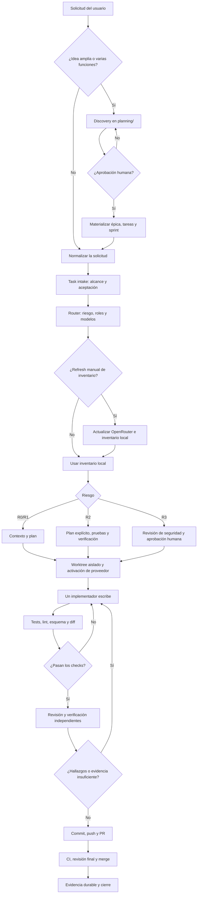
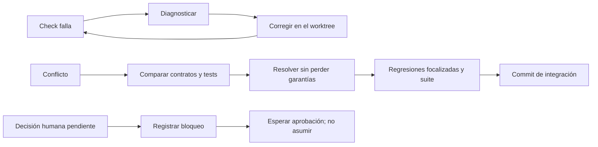

# Flujo operativo del Harness

Esta guía lleva una solicitud desde una idea hasta su integración en `main`. Los contratos ejecutables siguen siendo [AGENTS.md](../AGENTS.md), `harness/manifest.yaml`, `.agents/roles/` y `.agents/skills/`.

## Vista completa



## Paso a paso

### 1. Clasificar

1. Para un cambio acotado, crear o usar una tarea en `tasks/`.
2. Para un producto, varias funciones o decisiones de alcance, empezar con discovery en `planning/`; no materializar tareas hasta obtener aprobación.
3. Si el pedido no está en inglés, preservar el original y generar una representación canónica con `EXACT_INTENT` antes de delegar.

### 2. Definir riesgo

| Riesgo | Antes de cerrar |
| --- | --- |
| R0 | Check focalizado. |
| R1 | Pruebas pertinentes y revisión independiente. |
| R2 | Plan, pruebas, verificación y revisión especializada si aplica. |
| R3 | Revisión adversarial/seguridad y aprobación humana antes de efectos externos. |

Una prueba aprobada no reemplaza una decisión humana requerida para R3.

### 3. Actualizar modelos sólo cuando se solicite

El refresh de OpenRouter es manual; ejecutar una tarea nunca debe contactar la red ni mutar el inventario.

```powershell
uv run python scripts/openrouter_sync.py --all
```

El router intersecta el inventario con los modelos disponibles en el host y elige por rol. El modo *minimum-sufficient* usa el modelo de menor recurso que cumple el umbral; no puede bajar mínimos R2/R3. Ver [MODEL_ROUTING.md](MODEL_ROUTING.md).

### 4. Aislar y activar

```powershell
uv run python scripts/worktree.py create TASK-ID

# Codex
uv run python scripts/providers/codex_activate_task.py tasks/TASK-ID.json

# OpenCode
uv run python scripts/providers/opencode_activate_task.py tasks/TASK-ID.json
```

Un worktree tiene un único escritor. Los adaptadores de proveedor son generados: modificar la fuente canónica y recompilar, nunca editar `.codex/agents/` a mano.

### 5. Contexto, implementación y checks

1. Leer tarea, aceptación, políticas y contexto mínimo.
2. En R2/R3, usar mapa de repositorio y snippets acotados; CodeGraph conserva entrega por archivo hasta aprobación humana.
3. Separar hechos, supuestos, riesgos y decisiones humanas.
4. Implementar cambios pequeños en el worktree.
5. Ejecutar checks y repetir tras cada corrección.

```powershell
uv run python -m unittest discover -s tests
uv run python -m compileall -q scripts tests
git diff --check
```

### 6. Revisión, PR y cierre

1. Un revisor independiente intenta falsar la solución.
2. Un verificador confirma criterios observables; para riesgos relevantes, un auditor revisa los tests.
3. Resolver hallazgos confirmados y repetir checks afectados.
4. Crear un commit coherente, push y PR contra `main`.
5. Tras CI y revisión, hacer merge.
6. Cerrar sólo con evidencia durable de aceptación, checks, revisión y verificación. R3 además requiere la procedencia firmada indicada por el contrato.

## Rutas alternativas



## Invariantes

- Nunca incluir secretos, tokens o datos confidenciales en contexto, commits o PRs.
- La fuente canónica gana sobre adaptadores generados.
- La evidencia determinista gana sobre afirmaciones.
- No forzar merges de cambios sin commit: revisarlos, hacer commits separados e integrarlos.
- Un Git con conflictos, cambios sin commit o checks fallidos no está listo para merge.

## Referencias

- [AGENTS.md](../AGENTS.md)
- [UNIFIED_HARNESS.md](UNIFIED_HARNESS.md)
- [CONTEXT_EFFICIENCY.md](CONTEXT_EFFICIENCY.md)
- [PARALLEL_MINIMUM_ROUTING.md](PARALLEL_MINIMUM_ROUTING.md)
