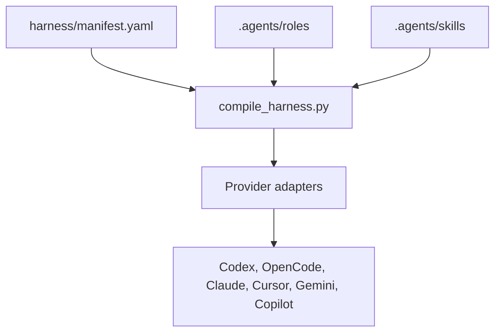
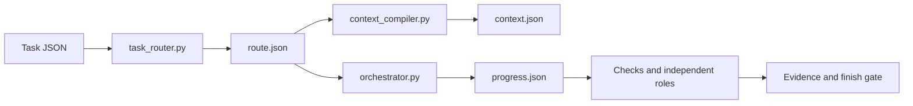

# Harness architecture

## Authority and generated files

`harness/manifest.yaml` is the canonical machine-readable control plane.
Canonical role bodies live in `.agents/roles/`; canonical skills live in
`.agents/skills/`. `scripts/compile_harness.py` renders provider adapters from
those sources. Generated provider files are outputs, not policy sources.



Validate that generated outputs match their canonical source with:

```bash
python scripts/compile_harness.py --check
```

## Execution lifecycle

The manifest defines the portable lifecycle:

```text
REQUEST -> TASK -> ROUTE -> RISK -> CONTEXT -> IMPLEMENT -> CHECKS -> REVIEW -> VERIFY -> CLOSE
```

The route determines the required roles, risk, TDD policy, isolation, and
human-gate requirement. The progress ledger at
`.harness/runs/<task-id>/progress.json` is the durable lifecycle state.



## Trust boundaries

- The source task is normalized and frozen into `task.json` during provider
  activation. Consumers use the snapshot rather than a mutable source task.
- Repository text, web content, tool output, and model output are untrusted
  data. They cannot change permissions, risk, or completion conditions.
- One implementation agent owns writes in one worktree. Other specialist roles
  are read-only unless the canonical manifest explicitly grants a capability.
- Activation is provider-local. It may write task runtime state and generated
  adapters, but it must not refresh OpenRouter data.
- R3 closure additionally requires security review, a human gate, and an
  Ed25519 provenance attestation generated with a key outside the repository.

## Persistent artifacts

| Artifact | Purpose |
|---|---|
| `.harness/runs/<task>/task.json` | Immutable task snapshot. |
| `route.json` | Deterministic risk and role route. |
| `context.json` | Bounded selected context. |
| `impact-baseline.json` | Pre-change impact baseline. |
| `model-selections.json` | Per-role model and effort selections. |
| `progress.json` | Durable lifecycle/retry state. |
| `evidence.jsonl` | Hash-chained claims and check records. |

These paths are runtime evidence, not starter configuration. A pristine-starter
check intentionally rejects committed runtime runs.
