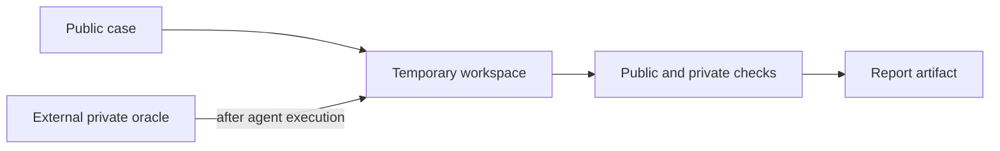

# Harness benchmark operation

## Purpose

`scripts/harness_benchmark.py` compares harness variants on declared cases in
temporary workspaces. It supports `validate`, `run`, and `report` subcommands.
Its exact current arguments are authoritative in:

```bash
python scripts/harness_benchmark.py --help
```

## Safe data boundary

Public case metadata may be versioned in `benchmarks/`. Hidden tests and oracle
files must live outside the repository and be copied into a temporary workspace
only after agent execution. A committed `demo-private` directory is a format
example, not a confidential holdout.



## Example commands

```bash
python scripts/harness_benchmark.py validate benchmarks/examples/suite.json
python scripts/harness_benchmark.py run benchmarks/examples/suite.json \
  --provider opencode --variants baseline,full --repetitions 3
```

The run depends on the selected provider CLI and any project setup declared by
the benchmark. Provider authentication, private-oracle availability, and model
behavior are external conditions; a command interface check cannot prove them.

## Interpretation

Compare only runs that state the same case set, variant, provider, model (when
pinned), repetition count, and oracle visibility. A result is useful evidence
for this benchmark corpus, not a universal claim that one model or harness
variant is superior.
