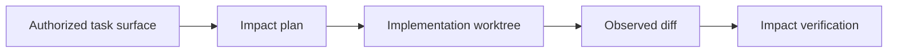

# Change impact and progressive agent budget: research rationale

> This is research rationale. The checked-in scripts and task artifacts are the
> authority for current behavior.

## Change impact

The harness creates a bounded impact plan before implementation and verifies
the observed change surface afterwards. The purpose is to make likely reverse
dependencies, neighboring tests, and high-fan-in files visible before a writer
changes code.

## Progressive agent budget

Mandatory risk gates remain required. Optional support roles are activated when
route risk, impact, or deterministic failure signals justify them, rather than
being launched merely because a task exists. The durable state is written under
`.harness/runs/<task-id>/agent-budget.json`.

This design is intended to reduce coordination overhead without weakening the
single-writer rule or evidence-backed closure requirements.
