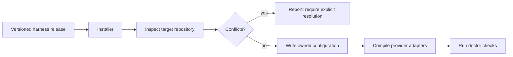

# Installation and portability status

## Current supported state

This harness is run from its source checkout. It is not yet distributed as a
Python package or standalone CLI: the repository contains no `pyproject.toml`,
`setup.py`, package lock, or `harnes init` entry point. Therefore the following
are not current commands and must not be presented as available behavior:

```text
pipx install harnes
harnes init
harnes upgrade
harnes uninstall
```

The deterministic, source-checkout verification path is:

```bash
python scripts/compile_harness.py --check
python -m unittest discover -s tests -p "test_*.py" -v
python scripts/run_evals.py
```

`scripts/check_harness.py` validates a pristine starter tree and deliberately
rejects a checkout that already has `.harness/runs/` evidence.

## Planned portable installation capability

The intended product outcome is a versioned installer that can adopt an
existing Git repository without copying this repository wholesale or silently
overwriting repository-owned files. This is a planned capability, not an
implemented interface.



An implementation should provide these independently testable outcomes:

| Outcome | Required safety property |
|---|---|
| Versioned distribution | Exact installed harness version is recorded. |
| `init` | Detects Git and existing agent files; never overwrites without explicit confirmation. |
| `doctor` | Reports prerequisites, provider availability, generated-adapter drift, and configuration conflicts. |
| `upgrade` | Performs versioned, reversible migrations and recompiles generated adapters. |
| `uninstall` | Removes only installer-owned files recorded in its manifest. |

The target installer must define ownership before it writes anything. Candidate
runtime state belongs under `.harness/`; canonical policy and provider adapter
locations may overlap with target-repository files and therefore require an
explicit merge/conflict strategy. Do not claim cross-repository installation is
supported until this interface, migration contract, and tests exist.

## Provider prerequisites

Provider adapters are generated locally. Their file syntax can be checked by
`python scripts/compile_harness.py --check`; actual provider discovery and
authentication must be checked with the installed provider's own tooling.

Codex task activation writes `.harness/codex/active-task.json` and regenerates
`.codex/agents/*.toml`. OpenCode activation writes its corresponding binding.
Both actions are local project mutations and must be cleared after the task.

## OpenRouter data refresh

OpenRouter is contacted only by an explicit refresh:

```bash
OPENROUTER_API_KEY="..." python scripts/openrouter_sync.py --all --no-endpoints
```

This writes `.harness/openrouter/model-scores.json`, then builds provider
inventories under `.harness/model-inventories/`. `--provider codex` or
`--provider opencode` consumes the existing score catalog; `--cache-only`
forbids network refresh. Task activation consumes local inventory and does not
contact OpenRouter.
