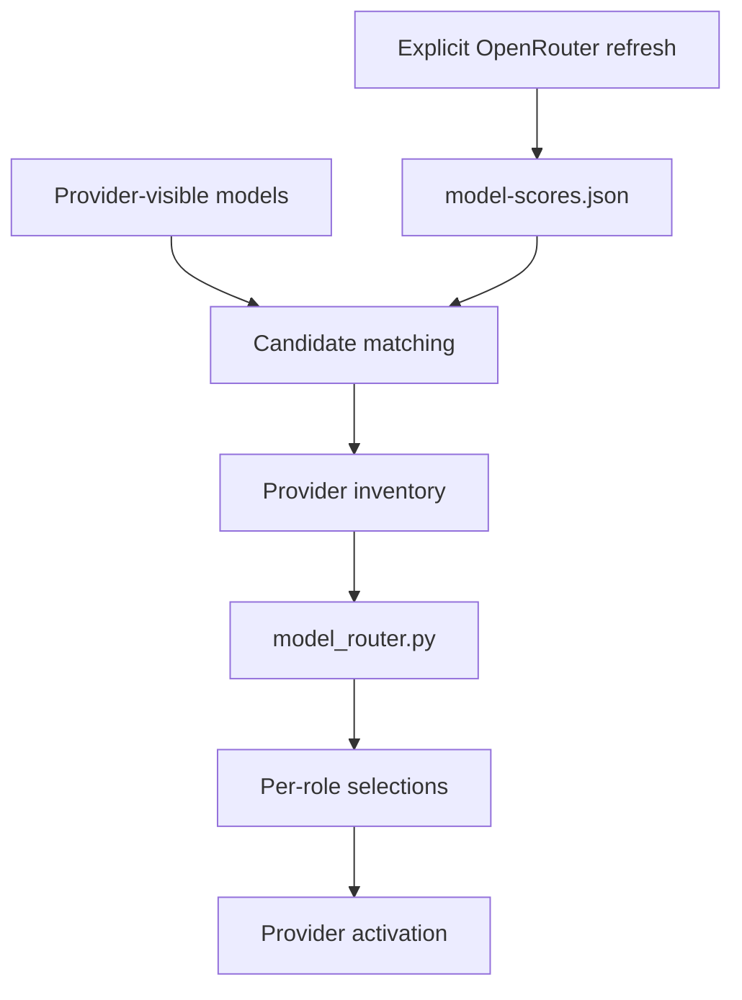

# Model routing and OpenRouter score refresh

## Trust model

The harness keeps provider availability and external scores separate:

1. Provider discovery decides which models are available to the current host.
2. An explicit OpenRouter refresh writes a shared local score catalog.
3. Provider inventories match available candidates to that catalog.
4. The router selects a model and reasoning effort for each role and task.
5. Activation persists selections and generates provider-specific bindings.

OpenRouter never determines whether a provider can run a model. Activation
never contacts OpenRouter.



## Refresh scores

The only network-refresh path is `--all` (or `--openrouter-only`). It uses
`OPENROUTER_API_KEY` for authenticated benchmark access when available:

```bash
OPENROUTER_API_KEY="..." python scripts/openrouter_sync.py --all --no-endpoints
```

The command writes `.harness/openrouter/model-scores.json` and builds both
provider inventories under `.harness/model-inventories/`. Optional endpoint
health requests are enabled by default; `--no-endpoints` skips them.

```text
--all                 Refresh OpenRouter once; build Codex and OpenCode inventories.
--openrouter-only     Refresh only the shared score catalog.
--provider codex      Build Codex inventory from existing local score catalog.
--provider opencode   Build OpenCode inventory from existing local score catalog.
--cache-only          Forbid network refresh; use existing score catalog.
```

If the shared score catalog is absent, a provider-only or cache-only invocation
fails and instructs the operator to run the full refresh. The catalog stores
fetch errors and provenance; missing information remains unknown rather than
being fabricated.

## Matching and scoring

Provider candidates are matched to OpenRouter entries using exact-normalized
matches or explicit aliases. Ambiguous and unmatched candidates are preserved as
such. The generated inventory retains raw metrics, source provenance, matching
status, and derived capability scores. A derived ID is not treated as a
confirmed match without those matching outcomes.

The router applies role- and risk-specific capability targets, hard eligibility
floors, score weighting, reasoning-effort selection, and review independence
preferences. The configuration and implementation authorities are
`harness/models.json`, `harness/model-providers/*.json`,
`scripts/model_router.py`, and `scripts/openrouter_sync.py`.

For reviewer, verifier, test-auditor, and security-reviewer roles, the router
prefers a different model, then family, then vendor where an eligible comparable
alternative exists. The persisted selection records the actual independence
strength, including fallback where independence is unavailable.

## Provider activation

```bash
python scripts/providers/codex_activate_task.py tasks/TASK-001.json
python scripts/providers/opencode_activate_task.py tasks/TASK-001.json
```

Codex activation reads the local scored inventory, filters it against current
runtime discovery where possible, writes `.harness/codex/active-task.json`, and
regenerates `.codex/agents/*.toml` with selected `model` and
`model_reasoning_effort`. OpenCode activation writes its provider binding.

Clear the binding after task work:

```bash
python scripts/providers/codex_activate_task.py --clear
python scripts/providers/opencode_activate_task.py --clear
```

`codex_activate_task.py --refresh-active` recomputes bindings from the immutable
task snapshot for future sessions; it does not claim to change a model already
running in the current session.

## Verify local interfaces

```bash
python scripts/openrouter_sync.py --help
python scripts/providers/codex_activate_task.py --help
python scripts/providers/opencode_activate_task.py --help
```

Live provider discovery, account visibility, OpenRouter responses, and pricing
remain external, time-varying facts. Verify them in the target environment.
