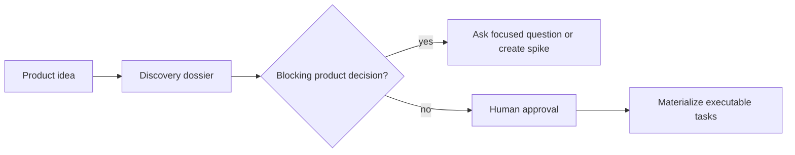

# Product discovery

Broad product ideas are not automatically executable engineering tasks. The
`idea-to-work` skill classifies the request as a project, epic, feature, task,
or spike; records the original request; and creates a canonical English
representation before downstream routing when necessary.



Draft discovery artifacts may be stored under `planning/`, but executable tasks
may be materialized only after approval and resolution of blocking questions.

```bash
python scripts/product_planning.py validate planning/discovery/DISC-XYZ.json
python scripts/product_planning.py materialize planning/discovery/DISC-XYZ.json
```

The materializer operates on repository-local planning and task artifacts. A
derived task preserves provenance to its discovery dossier instead of claiming
that it is a literal translation of the original product request.
