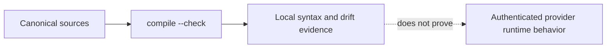

# Provider compatibility

## Portable core and provider-native boundaries

The portable core is the canonical manifest, roles, skills, task artifacts,
risk policy, and evidence contract. Provider directories are generated adapter
outputs. The current manifest defines adapters for Codex, OpenCode, Claude,
Cursor, Gemini, and Copilot.

| Provider | Generated adapter location | Active-task behavior |
|---|---|---|
| Codex | `.codex/agents/*.toml` | Task activation persists a Codex binding and injects selected model/effort into regenerated agents. |
| OpenCode | `.opencode/agents/*.md` and plugin assets | Task activation persists an OpenCode binding consumed by its local integration. |
| Claude | `.claude/agents/*.md`, `.claude/skills/` | Generated adapter; live behavior depends on the installed CLI. |
| Cursor | `.cursor/agents/*.md` | Generated adapter; live behavior depends on the installed CLI. |
| Gemini | `.gemini/agents/*.md` | Generated adapter; live behavior depends on the installed CLI. |
| Copilot | `.github/agents/*.agent.md` | Generated adapter; live behavior depends on the installed CLI. |

## Verification level

`python scripts/compile_harness.py --check` deterministically checks generated
artifact synchronization. It does not prove that a provider CLI version,
account, organization policy, or sandbox accepts and invokes every adapter.
Use the provider's own inspection/runtime command in the target environment.

## Privilege model

The canonical manifest marks `implementer` as the only writer. Exploration,
planning, research, review, security review, test audit, debugging, and
verification are read-only roles; debugger and verifier may execute allowed
checks. Provider sandboxes and permission prompts remain authoritative where a
provider supports them.

Hooks provide an additional local policy bridge. They do not silently grant
provider permissions or replace human approval for external side effects.

## Current portability limitation

This repository has no supported cross-repository installer. See
[INSTALLATION.md](INSTALLATION.md) for the current source-checkout status and
the requirements for a future safe installer.
