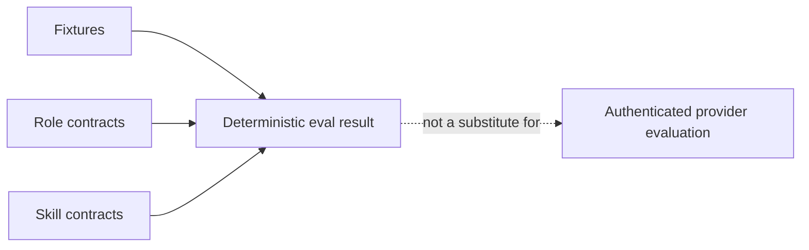

# Deterministic evaluations

The default evaluation suite is credential-free and deterministic. It checks
behavior fixtures, canonical role contracts, and canonical skill structure; it
does not measure live model quality.

```bash
python scripts/run_evals.py
```



For repeated provider-backed evaluation, `scripts/runtime_eval.py` accepts a
suite and an external adapter command. The adapter owns provider authentication
and must write a result JSON containing at least `passed: true|false`.

```bash
python scripts/runtime_eval.py --help
```

Keep credentials and private holdouts outside the repository. Live provider
results are external evidence and must record their provider, model, timestamp,
and execution environment.
